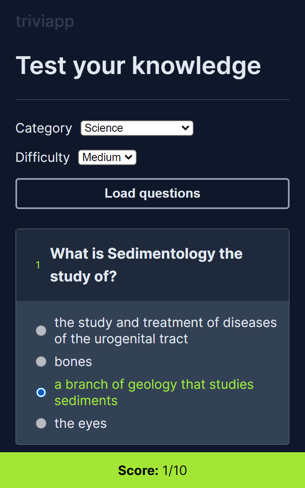

# Triviapp

---

## 📕 About

Triviapp is a trivia app that allows you to test your knowledge on several subjects with fun questions.

---

## ⚒️ Used Technologies

To develop this app, I used these technologies:

- HTML5
- SCSS
- Javascript
- Vite

---

## ✨ Features

- Responsivity
- Accessability
- Mobile-first design

---

## 🤝 Be a Contributor

Have any idea that can help boost the project, and want to share it? It's simple!

1. Fork the project
2. Modify what you want
3. Commit the changes
4. Open a Pull Request

---

## 🔓 License

This project is under license. Click [here](./LICENSE.md) for details.
